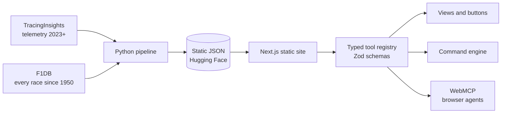

<p align="center">
  <picture>
    <source media="(prefers-color-scheme: dark)" srcset="apps/web/public/brand/wordmark-on-dark.png">
    
  </picture>
</p>

<p align="center">
  <strong>Formula 1 analysis you can ask in plain English, and an AI agent can drive.</strong><br>
  Lap duels, race replays, strategy, and every Grand Prix weekend since 1950. Free, open source, no account.
</p>

<p align="center">
  <a href="https://github.com/SunTribe1/unbox-box/actions/workflows/ci.yml"></a>
  <a href="LICENSE"></a>
  
  
  <a href="CONTRIBUTING.md"></a>
</p>

> Unofficial, non-commercial fan project. Not associated in any way with the Formula 1 companies.


## Try asking

- _Where did Norris lose time to Verstappen?_
- _Leclerc vs Hamilton at Ascari_
- _Who was fastest in sector 2?_
- _The 2021 title fight_ · _Most wins in the 90s_ · _Tell me about Jim Clark_

The built-in command engine answers these instantly, offline, with no API key. Browsers with
an AI agent that supports **WebMCP** can call the same 27 tools directly.

## What's inside

| Section              | What it does                                                                                                       |
| -------------------- | ------------------------------------------------------------------------------------------------------------------ |
| **Lap Duel**         | Two laps trace by trace (speed, throttle, brake, gear, RPM), running gap, mini-sector map, corner-by-corner losses |
| **Race Replay**      | Every car on the track map, live timing tower, race control, a followed-car HUD, pop-out tower                     |
| **Strategy Lab**     | Stints, degradation, pit stops, a 500-run pit-stop simulator and an undercut check                                 |
| **History Explorer** | Head-to-heads, and a profile for every driver and team since 1950 (teammates, cars, family)                        |
| **Race Archive**     | Every weekend since 1950: the title fight, calendar, entry list, and every session from practice to race           |
| **Circuits**         | Layouts with corners, past layouts, lap records, most successful drivers and teams                                 |
| **Record Book**      | 20+ leaderboards with an era filter; closest finishes, biggest wins, best pit crews                                |
| **Engines & Tyres**  | Every engine and tyre maker: wins by season, teams supplied, engines by era, the tyre wars                         |
| **Nations**          | Drivers, champions, teams and circuits by country                                                                  |
| **Race Engineer**    | Plain-English questions → typed tool calls → answers, with the page changing as it works                           |
| **Help & feedback**  | A guide to every page, colours and terms, a developer guide, and a bug-report form                                 |

Everywhere: shareable links for every view, ⌘K search, keyboard shortcuts, dark and light
themes, reduced motion, installable, works offline.

<table>
  <tr>
    <td></td>
    <td></td>
  </tr>
  <tr>
    <td></td>
    <td></td>
  </tr>
</table>

## Quick start

Requires Node 22+ ([uv](https://docs.astral.sh/uv/) only for rebuilding data).

```bash
git clone https://github.com/SunTribe1/unbox-box.git
cd unbox-box
npm install
npm run dev            # http://localhost:3000, with bundled Monza 2025 demo data
```

The full archive (every session since 2023) is served from a Hugging Face dataset; point
`NEXT_PUBLIC_DATA_BASE` at it, or build your own with `npm run data:sync` (see
[pipeline/README.md](pipeline/README.md)). All settings are in
[apps/web/.env.example](apps/web/.env.example).

## How it works



- **No server.** The site is a static export; data is plain JSON on a CDN, validated with Zod
  on load and cached for offline use.
- **One tool registry.** Buttons, the command engine and browser agents call the same typed
  functions, so what an agent does is exactly what a click does.
- **Decisions are written down** in [docs/adr](docs/adr): static data, the tool registry,
  lap-delta alignment, data hosting, security headers, archive files, feedback without a backend.

| Package           | Role                                                                          |
| ----------------- | ----------------------------------------------------------------------------- |
| `apps/web`        | Next.js 16 static export, React 19, Tailwind CSS v4, shadcn/ui, Motion, uPlot |
| `packages/tools`  | Data schemas, analysis, the 27 tools, the command engine                      |
| `packages/webmcp` | The only code that touches the WebMCP browser API                             |
| `pipeline`        | Python: fetch → align → resample → write JSON                                 |

In the app, **Help → For developers** documents the full stack, data flow, WebMCP set-up and
every tool.

## Quality

```bash
npm run check           # format, lint, types, spelling, dead code, unit tests
npm run test:coverage   # unit tests with coverage gates
npm run build && npm run test:e2e   # Playwright
```

| Check      | Tool                                                                                                                          |
| ---------- | ----------------------------------------------------------------------------------------------------------------------------- |
| Formatting | Prettier with the Tailwind class-order plugin                                                                                 |
| Lint       | ESLint (Next.js rules for the app, typescript-eslint strict for packages)                                                     |
| Types      | TypeScript strict, `noUncheckedIndexedAccess`                                                                                 |
| Spelling   | CSpell, British English                                                                                                       |
| Dead code  | knip: unused files, exports and dependencies                                                                                  |
| Unit tests | Vitest with coverage gates (tools 85%, WebMCP 85%, web `lib/` 80%); React Testing Library for components                      |
| End to end | Playwright: journeys, a 5-width responsive matrix, WCAG 2.1 AA checks (axe) in both themes and every overlay, offline mode    |
| Security   | CSP and security headers ([ADR 0005](docs/adr/0005-security-headers-and-csp.md)); tests fail on any CSP violation; Dependabot |
| Git hooks  | lint-staged (format, spelling) and commitlint (Conventional Commits) on every commit                                          |
| Pipeline   | Ruff and pytest                                                                                                               |

## Contributing

Contributions are welcome: bug fixes, features, data corrections, docs. Start with
[CONTRIBUTING.md](CONTRIBUTING.md), and look for issues labelled
[good first issue](https://github.com/SunTribe1/unbox-box/labels/good%20first%20issue).
Please read the [code of conduct](CODE_OF_CONDUCT.md), and report security problems privately
([SECURITY.md](SECURITY.md)).

## Acknowledgements

Unbox Box stands on other people's open work. Thank you to:

- **[F1DB](https://github.com/f1db/f1db)** by Marcel Overdijk and contributors: every World
  Championship weekend since 1950 (CC BY 4.0).
- **[TracingInsights](https://github.com/TracingInsights)**: telemetry, laps and race control
  for every session since 2023 (2023–2024 MIT, 2025–2026 Apache-2.0;
  DOI [10.5281/zenodo.17312802](https://doi.org/10.5281/zenodo.17312802)).
- **[FastF1](https://github.com/theOehrly/Fast-F1)** by Philipp Schäfer and contributors (MIT),
  **[Jolpica-F1](https://github.com/jolpica/jolpica-f1)** (Apache-2.0) and
  **[MultiViewer](https://github.com/f1multiviewer)**, which TracingInsights builds on.
- **[flag-icons](https://github.com/lipis/flag-icons)** by Panayiotis Lipiridis (MIT);
  **Inter** and **JetBrains Mono** (SIL OFL 1.1); **Lucide** icons (ISC).
- **Next.js, React, Tailwind CSS, shadcn/ui, Radix UI, Motion, uPlot, Recharts, TanStack
  Query, Zustand, Zod** and the rest of the open-source libraries listed on the
  [Credits page](apps/web/src/app/credits/credits.ts), with full texts in
  [THIRD_PARTY_NOTICES.txt](apps/web/public/THIRD_PARTY_NOTICES.txt).
- **GitHub**, **Hugging Face** and **Web3Forms** for free hosting and services.

The app's own Credits page (`/credits/`) lists every data source, library, font, icon set and
service with its licence and the changes we made.

## Licence

Code: [MIT](LICENSE). Data files keep their sources' licences (CC BY 4.0, MIT, Apache-2.0); see
[DATA_LICENSE.md](apps/web/public/data/DATA_LICENSE.md). The Unbox Box name and logo are the
project's own.

F1, FORMULA ONE, FORMULA 1, FIA FORMULA ONE WORLD CHAMPIONSHIP, GRAND PRIX and related marks are
trademarks of Formula One Licensing B.V. Unbox Box uses no official photographs, logos or
footage.
