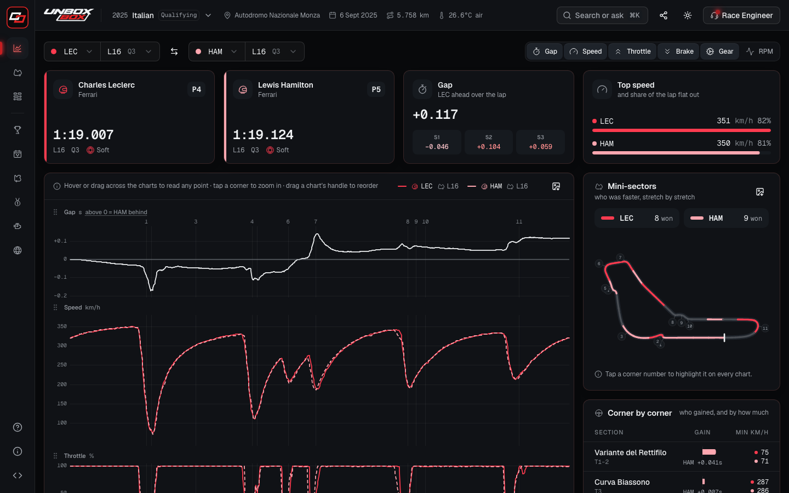
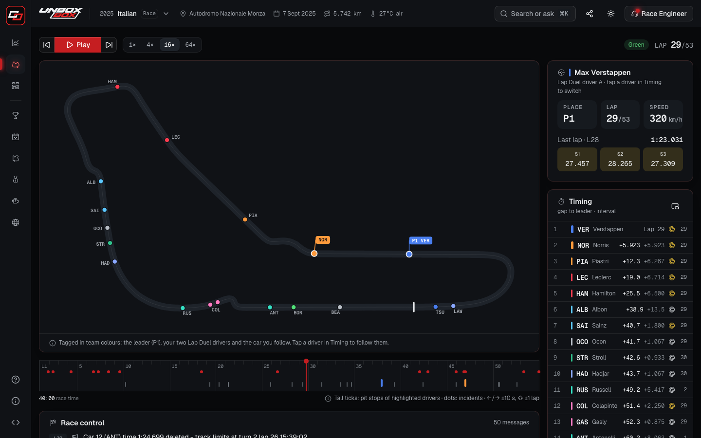
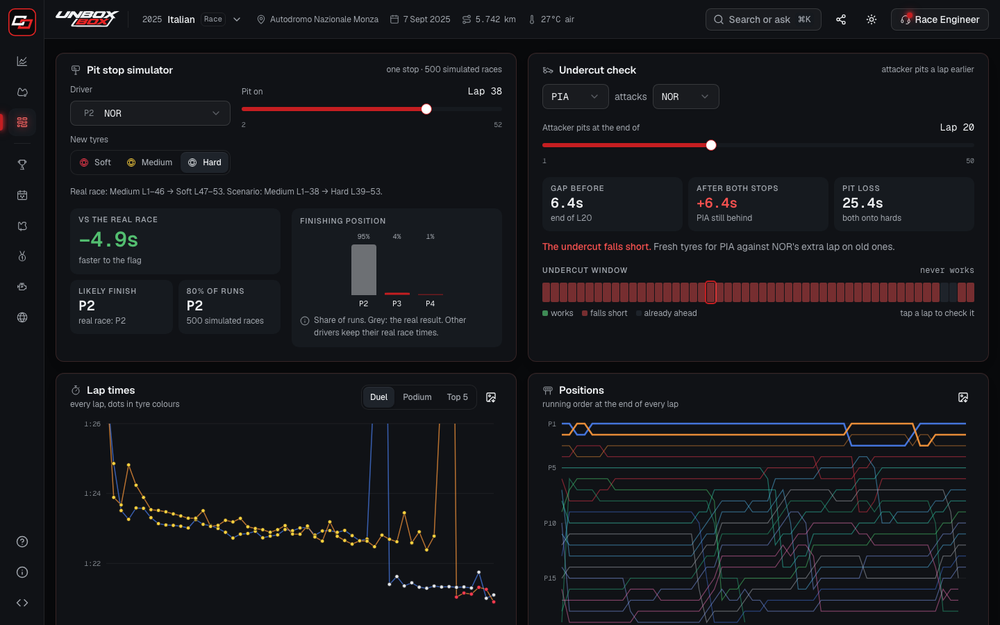
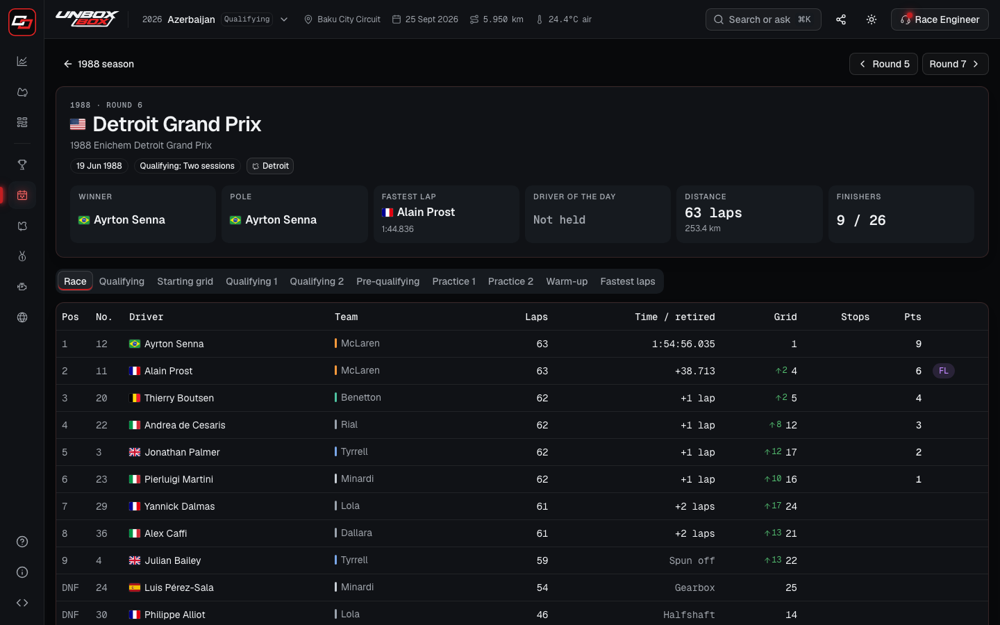
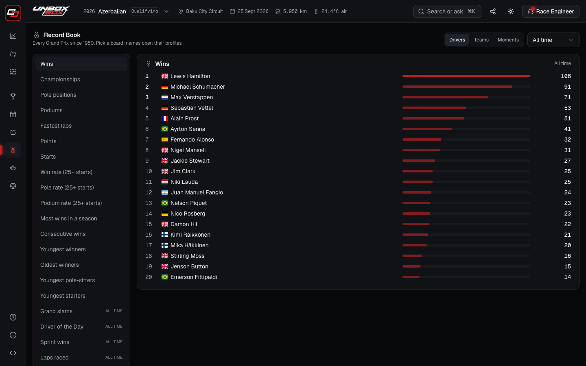
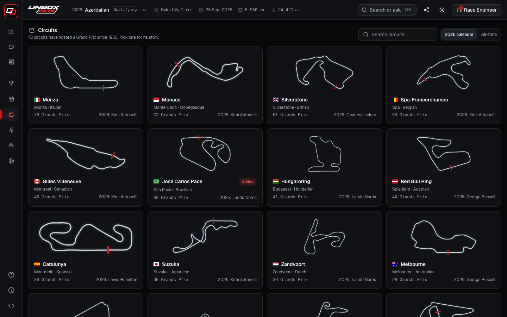
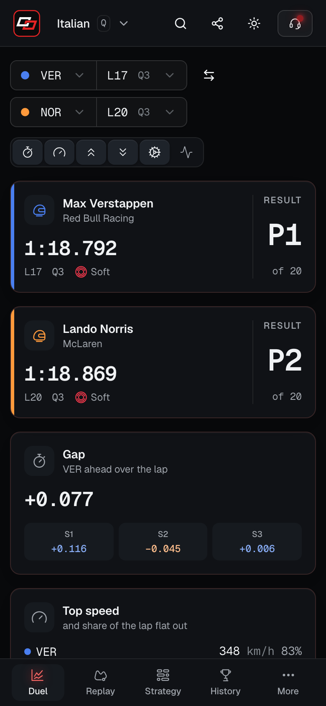
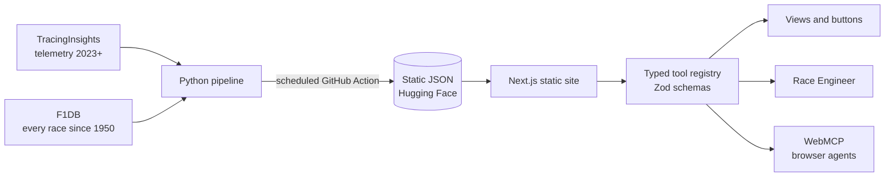

<p align="center">
  <picture>
    <source media="(prefers-color-scheme: dark)" srcset="apps/web/public/brand/wordmark-on-dark.png">
    
  </picture>
</p>

<p align="center">
  <strong>Formula 1 analysis you can ask in plain English, and an AI agent can drive.</strong><br>
  Lap duels, race replays, strategy, and every Grand Prix since 1950. Free, open source, no account.
</p>

<p align="center">
  <a href="https://unboxbox.com"><strong>unboxbox.com</strong></a>
</p>

<p align="center">
  <a href="https://github.com/SunTribe1/unbox-box/actions/workflows/ci.yml"></a>
  <a href="https://github.com/SunTribe1/unbox-box/actions/workflows/codeql.yml"></a>
  <a href="LICENSE"></a>
  
  
  <a href="CONTRIBUTING.md"></a>
</p>

> A hobby project, built and looked after by a Formula 1 fan in their spare time. Unofficial and
> non-commercial: not associated in any way with the Formula 1 companies.



## Try asking

- _Where did Piastri lose time to Norris?_
- _Leclerc vs Hamilton at Ascari_
- _Who was leading on lap 30?_
- _The 2021 title fight_ · _Most wins in the 90s_ · _Tell me about Jim Clark_

The built-in Race Engineer answers these instantly in your browser: no account, no API key, and
it works offline. Browsers with an AI agent that supports **WebMCP** can call the same 27 tools
directly, and you watch the page change as the agent works.

## Two data sets

| Data                    | Covers                         | What it is                                                                                          | Powers                                                                 |
| ----------------------- | ------------------------------ | --------------------------------------------------------------------------------------------------- | ---------------------------------------------------------------------- |
| **Telemetry**           | 2023 onwards, every session    | Speed, throttle, brake, gear, RPM and car positions every few metres; laps, pit stops, race control | Lap Duel, Race Replay, Strategy Lab                                    |
| **Results and history** | 1950 onwards, every Grand Prix | Results, grids, qualifying, standings, entry lists, pit stops, lap records, engines, tyres          | Race Archive, Record Book, Circuits, History, Engines & Tyres, Nations |

So the 1988 Monaco Grand Prix is all there in the Race Archive, but two 1988 laps can't be
compared trace by trace: car telemetry from that era was never published. New sessions arrive a
few hours after they end, with no redeploy.

## What's inside

| Section              | What it does                                                                                                       |
| -------------------- | ------------------------------------------------------------------------------------------------------------------ |
| **Lap Duel**         | Two laps trace by trace (speed, throttle, brake, gear, RPM), running gap, mini-sector map, corner-by-corner losses |
| **Race Replay**      | Every car on the track map, live timing tower, race control, safety car periods, a followed-car HUD                |
| **Strategy Lab**     | Stints, tyre degradation, pit stops, a 500-run pit-stop simulator and an undercut check                            |
| **Race Archive**     | Every weekend since 1950: the title fight, calendar, entry list, and every session from practice to race           |
| **History Explorer** | Head-to-heads, and a profile for every driver and team since 1950 (teammates, cars, family)                        |
| **Circuits**         | Layouts with corners, past layouts, lap records, most successful drivers and teams                                 |
| **Record Book**      | 20+ leaderboards with an era filter; closest finishes, biggest wins, best pit crews                                |
| **Engines & Tyres**  | Every engine and tyre maker: wins by season, teams supplied, engines by era, the tyre wars                         |
| **Nations**          | Drivers, champions, teams and circuits by country                                                                  |
| **Race Engineer**    | Plain-English questions → typed tool calls → answers, with the page changing as it works                           |
| **Help & feedback**  | A guide to every page, colours and terms, a developer guide, and a bug-report form                                 |

Everywhere: a clean, shareable link for every page (`/races/1988/3/qualifying/`,
`/duel/2025-italian-grand-prix-q/LEC-16-vs-HAM-16/`), ⌘K search, keyboard shortcuts, dark and
light themes, reduced motion, installable, works offline. The landing page at
[unboxbox.com](https://unboxbox.com) shows each view with real screen recordings, and enters the
app behind a five-light start sequence that goes out once the data has loaded.

<table>
  <tr>
    <td></td>
    <td></td>
  </tr>
  <tr>
    <td></td>
    <td></td>
  </tr>
  <tr>
    <td></td>
    <td align="center"></td>
  </tr>
</table>

## Let your AI drive it (WebMCP)

[WebMCP](https://github.com/webmachinelearning/webmcp) is a proposed web standard that lets an AI
agent in your browser use a site's own tools instead of guessing at buttons.

1. Use Chrome 146 or newer and turn on `chrome://flags/#enable-webmcp-testing`, then relaunch.
2. Open [unboxbox.com](https://unboxbox.com). The Race Engineer header shows WebMCP as connected once the
   tools are registered with `document.modelContext`.
3. Ask your browser agent something like _"compare Norris and Piastri's qualifying laps"_. Each
   call it makes is listed in the Race Engineer panel, and the page changes as if you had clicked.

Every call is validated against its Zod schema before it runs. Some tools only read data; the rest
change what is on screen, and nothing else. The questions go to your own agent, never to us: there
is no server. Site owners can switch WebMCP on for every Chrome visitor with an origin-trial token
(`NEXT_PUBLIC_WEBMCP_ORIGIN_TRIAL`).

## Quick start

Requires Node 22+ ([uv](https://docs.astral.sh/uv/) only for rebuilding data).

```bash
git clone https://github.com/SunTribe1/unbox-box.git
cd unbox-box
npm install            # also installs the Git hooks
npm run dev            # http://localhost:3000, with bundled 2025 Italian GP demo data
```

The full data lives in a public Hugging Face dataset. Point `NEXT_PUBLIC_DATA_BASE` at it, or
build your own with `npm run data:sync` (see [pipeline/README.md](pipeline/README.md)). Every
setting is documented in [apps/web/.env.example](apps/web/.env.example).

## Deploy

It's a static site, free to host. [docs/deploy.md](docs/deploy.md) covers Vercel (root directory
`apps/web`), Netlify and Cloudflare Pages, the Hugging Face data set-up, the scheduled data sync
and the GitHub repository settings.

## How it works



- **No server.** The site is a static export; data is plain JSON on a CDN, validated with Zod on
  load and cached for offline use.
- **Data that updates itself.** A scheduled GitHub Action builds each new session and publishes
  it; the site reads the session list on every visit, so new races need no redeploy.
- **One tool registry.** Buttons, the Race Engineer and browser agents call the same typed
  functions, so what an agent does is exactly what a click does.
- **Real URLs on a static host.** One page per view; the host rewrites deeper paths to it and the
  app reads the rest of the path, so every page has a clean link that survives a reload.
- **Decisions are written down** in [docs/adr](docs/adr): static data, the tool registry, lap-delta
  alignment, data hosting, security headers, archive files, feedback without a backend, path URLs
  on a static host.

### Stack

| Layer    | Technology                                                                            |
| -------- | ------------------------------------------------------------------------------------- |
| App      | Next.js 16 (static export), React 19, TypeScript strict                               |
| UI       | Tailwind CSS v4 design tokens, shadcn/ui on Radix UI, Motion, Geist and Geist Mono    |
| Charts   | uPlot (telemetry), Recharts (seasons and stints), canvas and SVG (track maps)         |
| State    | Zustand (mirrored to the URL), TanStack Query (data and cache), Zod (every data file) |
| Pipeline | Python with NumPy; `uv` for environments                                              |
| Hosting  | Vercel (site), Hugging Face (data), Cloudflare (DNS), Web3Forms (bug reports)         |

### Repository layout

```text
apps/web            Next.js app: src/app (routes), src/features (one folder per view and the
                    landing page), src/components (shared UI), src/lib (state, data, routes)
apps/web/scripts    Build scripts: security headers and host rewrites, notices, screen recordings
packages/tools      Data schemas, analysis, the 27 tools and the Race Engineer. No React
packages/webmcp     The only code that touches the WebMCP browser API
pipeline            Python data pipeline: sources, alignment, replays, history, publishing
docs                Architecture decisions, brand guide, deployment guide, screenshots
.github             CI, pull request checks, CodeQL, data sync, branch ruleset, templates
```

In the app, **Help → For developers** documents the stack, data flow, URL scheme, WebMCP set-up
and every tool.

## Quality

```bash
npm run check           # format, lint (ESLint, Stylelint), types, spelling, dead code, unit tests
npm run test:coverage   # unit tests with coverage gates
npm run build && npm run test:e2e   # Playwright
```

| Check      | Tool                                                                                                                                                                                                 |
| ---------- | ---------------------------------------------------------------------------------------------------------------------------------------------------------------------------------------------------- |
| Formatting | Prettier with the Tailwind class-order plugin                                                                                                                                                        |
| Lint       | ESLint (Next.js rules and jsx-a11y for the app, typescript-eslint strict for packages); Stylelint for CSS                                                                                            |
| Types      | TypeScript strict, `noUncheckedIndexedAccess` (and `exactOptionalPropertyTypes` in the packages)                                                                                                     |
| Spelling   | CSpell, British English                                                                                                                                                                              |
| Dead code  | knip: unused files, exports and dependencies                                                                                                                                                         |
| Unit tests | Vitest with coverage gates (tools 85%, WebMCP 85%, web `lib/` 80%); React Testing Library for components                                                                                             |
| End to end | Playwright: journeys, a 5-width responsive matrix, WCAG 2.1 AA checks (axe) in both themes and every overlay, offline mode                                                                           |
| Security   | CSP and security headers ([ADR 0005](docs/adr/0005-security-headers-and-csp.md)); tests fail on any CSP violation; CodeQL; dependency review; `npm audit`; SHA-pinned, read-only Actions; Dependabot |
| Git        | lint-staged and commitlint hooks; CI lints every commit and pull request title; `main` protected by a [ruleset](.github/rulesets/main.json)                                                          |
| Pipeline   | Ruff and pytest                                                                                                                                                                                      |

## Contributing

Contributions are welcome: bug fixes, features, data corrections, docs. `main` is protected:
every change is a reviewed, squash-merged pull request with green CI. Start with
[CONTRIBUTING.md](CONTRIBUTING.md), and look for issues labelled
[good first issue](https://github.com/SunTribe1/unbox-box/labels/good%20first%20issue). Please
read the [code of conduct](CODE_OF_CONDUCT.md), and report security problems privately
([SECURITY.md](SECURITY.md)).

## Acknowledgements

Unbox Box stands on other people's open work. Thank you to:

- **[F1DB](https://github.com/f1db/f1db)** by Marcel Overdijk and contributors: every World
  Championship weekend since 1950 (CC BY 4.0).
- **[TracingInsights](https://github.com/TracingInsights)**: telemetry, laps and race control for
  every session since 2023 (2023–2024 MIT, 2025–2026 Apache-2.0; DOI
  [10.5281/zenodo.17312802](https://doi.org/10.5281/zenodo.17312802)).
- **[FastF1](https://github.com/theOehrly/Fast-F1)** by Philipp Schäfer and contributors (MIT),
  **[Jolpica-F1](https://github.com/jolpica/jolpica-f1)** (Apache-2.0) and
  **[MultiViewer](https://github.com/f1multiviewer)**, which TracingInsights builds on.
- **[flag-icons](https://github.com/lipis/flag-icons)** by Panayiotis Lipiridis (MIT);
  **[Geist and Geist Mono](https://github.com/vercel/geist-font)** by Vercel (SIL OFL 1.1);
  **[Lucide](https://github.com/lucide-icons/lucide)** icons (ISC).
- **Next.js, React, Tailwind CSS, shadcn/ui, Radix UI, Motion, uPlot, Recharts, TanStack Query,
  Zustand, Zod** and the rest of the open-source libraries listed on the
  [Credits page](apps/web/src/app/credits/credits.ts), with full texts in
  [THIRD_PARTY_NOTICES.txt](apps/web/public/THIRD_PARTY_NOTICES.txt).
- **GitHub**, **Vercel**, **Hugging Face**, **Cloudflare** and **Web3Forms** for free hosting and
  services.

The site's [Credits page](https://unboxbox.com/credits/) lists every data source, library, font,
icon set and service with its licence and the changes we made.

## Licence

Code: [MIT](LICENSE). Data files keep their sources' licences (CC BY 4.0, MIT, Apache-2.0); see
[DATA_LICENSE.md](apps/web/public/data/DATA_LICENSE.md). The Unbox Box name and logo are the
project's own.

## Disclaimer

### Unofficial

Unbox Box is unofficial and is not associated in any way with the Formula 1 companies. It is not endorsed or sponsored by Formula One World Championship Limited, Formula One Management, Formula One Licensing B.V., the FIA or any team.

F1, FORMULA ONE, FORMULA 1, FIA FORMULA ONE WORLD CHAMPIONSHIP, GRAND PRIX and related marks are trade marks of Formula One Licensing B.V.

This is a free, non-commercial, fan-made application. It has no advertising, sponsorship or affiliate links.

### Trade marks

All product and company names are trade marks™ or registered® trade marks of their respective holders. Use of them does not imply any affiliation with or endorsement by them.

“Formula 1”, “F1”, “F1 TV”, “FIA”, “Alpine”, “Aston Martin”, “Audi”, “Cadillac”, “Ferrari”, “Haas F1 Team”, “McLaren”, “Mercedes”, “Racing Bulls”, “Red Bull”, “Red Bull Racing”, “Sauber”, “Williams”, “Honda”, “Renault”, “Ford”, “Pirelli”, and every other team, constructor, engine, tyre and sponsor name, past or present, are trade marks of their respective owners. They are not affiliated with, and do not sponsor or endorse, Unbox Box or its contributors.

Names of drivers, teams, circuits and events are used only to identify them, as facts. Team colours are our own approximations for telling cars apart on charts. Unbox Box uses no official photographs, logos, liveries, broadcast footage or audio.

### Data

Timing and telemetry come from TracingInsights (MIT for 2023–2024, Apache-2.0 from 2025), and results since 1950 from F1DB (CC BY 4.0), each used under its open licence, converted and resampled by us. TracingInsights, F1DB, FastF1 and the other projects credited here are independent and do not endorse Unbox Box.

Figures are provided as they are, without warranty, and may contain errors from the sources or from our processing.
